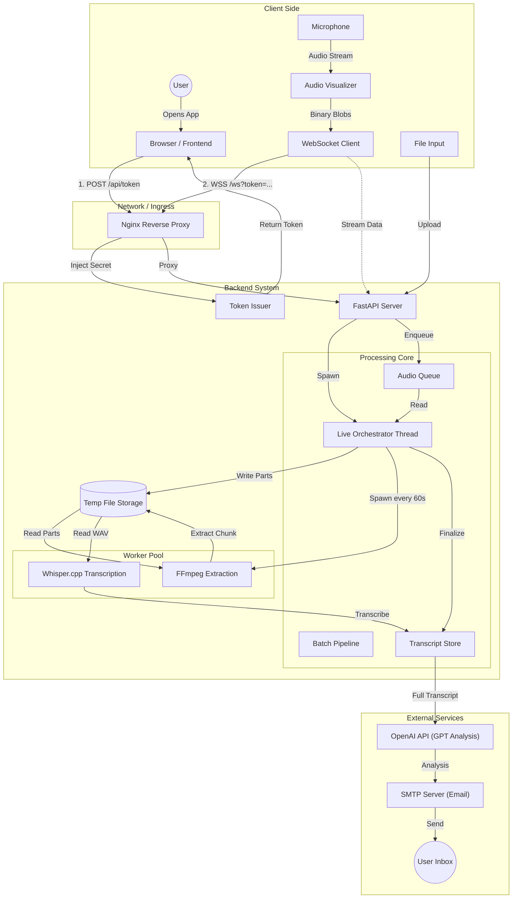
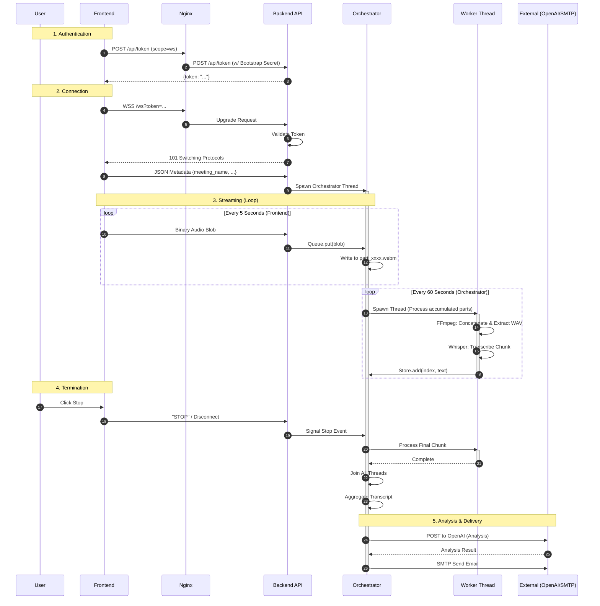

# smallpie
**Meeting intelligence, but cute :3**

**Version:** 0.6.2 (Frontend + Local Python Pipeline)

smallpie is a tiny, browser-based (explicitly mobile-friendly), tasty, portable prototype that turns meetings (ones that it can listen to from your phone, computer, raspberry, your grandma's laptop...) into structured transcripts, analysis, and actionable items sent to your email minutes after the meeting ends.

It runs anywhere where a modern browser and a mic exist. To be tested on a fridge soon.

---

## Privacy & Philosophy
**Your data is yours.**
* **Ephemeral:** No data is being kept long-term. Each session data is flushed after the final email is sent to the user.
* **No Tracking:** smallpie doesn't need your data for improving the product quality, to keep in touch with the latest promotions, or to train future models. 
* **Vision:** Friendly, minimal, fast, actually useful for a change, private.

---

## System Architecture
The system currently has two main components:

1.  **Frontend:** Vite + Tailwind. Features a custom FFT audio visualizer (client-side) to ensure your mic is actually working during recording.
2.  **Python Pipeline:** Local Whisper.cpp + FFMPEG chunking + "Diarization Consolidation Layer" (LLM-based) + Analysis.

*Note: The backend with real-time transcription and acoustic diarization arrives in version 0.8.x.*

### System Workflows

#### 1. High-Level Architecture


#### 2. Live Recording Sequence


### Backend Structure (Refactored Dec 2025)
The initial `meeting_server.py` monolith was split for readability. Entry point: `smallpie.backend.meeting_server:app`

* `pipeline.py`: Batch upload pipeline, live orchestrator, thread helpers.
* `audio.py`: ffprobe/ffmpeg helpers and whisper.cpp transcription.
* `analysis.py`: GPT analysis with a specialized prompt for fixing broken speaker segments.
* `auth.py`: Bearer and WS token checks.
* `config.py`: Env/config constants, paths, whisper settings, SMTP flags.
* `api.py`: FastAPI app + routes wiring pipelines.
* `emailer.py`: SMTP sender (HTML + text).

---

## Changelog & Updates

### 24 Dec 2025: Security & auth overhaul
*Addressing the biggest security problem so far - the static frontend->backend bearer token.*

* **Per-Session Tokens:** Replaced single static API token with on-demand session tokens via `/api/token`.
* **Scoped Access:** Tokens are signed with a backend key, scoped to WS/upload, and revoked after session end (recording stopped) /expiration (10 min currently, customizable in SMALLPIE_TOKEN_TTL_SECONDS).
* **Flow:**
    1.  Nginx proxies `/api/token` to backend (injecting `SMALLPIE_BOOTSTRAP_SECRET`).
    2.  Frontend receives a short-lived token (no auth header needed).
    3.  Token used for `/ws` (query param) and uploads (Bearer).
* **Env Variables:**
    * `SMALLPIE_SIGNING_KEY` (64-hex HMAC)
    * `SMALLPIE_BOOTSTRAP_SECRET` (Shared secret, server-side only)

#### Verification (Proof of Concept)
```bash
# 1. Generate a fresh scoped token
# Replace {YOUR-SERVER-URL} with your actual domain
TOKEN=$(curl -s -X POST https://{YOUR-SERVER-URL}/api/token -d scope=ws | jq -r .token)

# 2. Use token for WebSocket Upgrade -> Success (101 Switching Protocols)
curl -i -N \
  -H "Connection: Upgrade" \
  -H "Upgrade: websocket" \
  -H "Sec-WebSocket-Key: dGhlIHNhbXBsZSBub25jZQ==" \
  "https://{YOUR-SERVER-URL}/ws?token=${TOKEN}"
# Output: HTTP/1.1 101 Switching Protocols ...

# 3. Attempt to REUSE the same token -> Access Denied (Token consumed)
curl -i -N \
  -H "Connection: Upgrade" \
  -H "Upgrade: websocket" \
  "https://{YOUR-SERVER-URL}/ws?token=${TOKEN}"
# Output: HTTP/1.1 403 Forbidden ...
```

### Nov 16, 2025: v0.6.1 - Streaming Transcription Architecture
*Introduced near-real-time processing.*

* **Live Orchestrator:** Audio is segmented into fixed-duration slices (5s chunks from frontend -> reconstructed to 60s on backend).
* **Concurrent Pipeline:** Extraction and pre-processing happen in parallel threads.
* **Serialized Inference:** Actual Whisper transcription is semaphore-locked (1 job at a time) to prevent CPU thrashing on my tiny Hetzner server. Deliberately parametrized
in WHISPER_SEMAPHORE = threading.Semaphore(1) in config.py, change it as you will. 
* **Improvements:**
    * Thread-safe transcript aggregator.
    * Final-segment duration detection (prevents `ffprobe: duration 'N/A'` errors).
    * Safe flushing of raw audio before orchestrator finalization.

---

## Limitations (v0.6)

1.  **Near-real-time (Not true streaming):** Processing happens in fixed chunks (e.g., 60s), not token-level live streaming.
2.  **CPU-bound:** All transcription is local via `whisper.cpp` (CPU only). Concurrency is limited by design to avoid stalling the audio capture.
3.  **Chunk Boundaries:** Audio is split by duration. Chunks may cut mid-sentence - mitigated downstream during the semantic diarization phaze, but worth noting. 
4.  **Diarization:** Tested with max 4 speakers, works equally well as it does with 2. Multi-speaker thresholds (5 and more) are experimental.
5.  **No Retries:** If `whisper.cpp` fails, there is no fallback logic.
6.  **Temporary Files:** Cleanup is limited; WAV files may persist if pipeline crashes.
7.  **Frontend Feedback:** Minimal error reporting on the UI side.
8.  **Monitoring:** No metrics for latency, queue backlog, or throughput yet.

---

## Install & Run (tested on Ubuntu 22+)

### Prerequisites
```bash
sudo apt update && sudo apt install -y nodejs npm python3 python3-pip ffmpeg
```

### 1. Frontend
```bash
cd smallpie/frontend
npm install
npm run dev -- --host 0.0.0.0
# Open: http://YOUR_SERVER_IP:5173/
```

### 2. Python Pipeline (Local Mode)
**Dependencies:**
```bash
pip install sounddevice soundfile openai ffmpeg-python
```
*Requires: whisper.cpp compiled (make), whisper-cli in PATH, ffmpeg, OpenAI API Key as an environemnt variable at the moment.*

**Run:**
```bash
python3 assistant-openai-whisper.py
```

---

## Roadmap

* **v0.6 (Done):** WebSocket ingestion, Nginx proxy skeleton, Frontend <-> Backend connection, Gmail transcript sending.
* **v0.7 (Next):** Real-time audio streaming, Parallel transcription queue, ICS file creation, Multi-user support.
* **v0.8:** Real-time transcription & acoustic diarization.

---

## Legal & Ethical Considerations
*smallpie processes sensitive meeting data, including voice recordings, transcripts, participant names, and meeting context. To ensure responsible use and compliance with applicable laws, please review the following considerations carefully.*

### 1. User Responsibility for Consent
Recording conversations is regulated differently around the world.
**You, the user, are solely responsible for informing all meeting participants** that the session will be recorded, transcribed, and analyzed.
smallpie provides recording and analysis tools but does not verify or enforce participant consent.

### 2. Handling of Personal Data
smallpie may process the following types of data:
- Audio recordings (processed locally and deleted afterward)
- Transcripts
- Participant names and meeting metadata
- AI-generated summaries and insights

All data is processed **temporarily**.
smallpie does **not** store meeting data long-term, does **not** build user histories, and does **not** retain audio or transcripts after delivering results to the user.

### 3. Use of External AI Services
Analyses are performed using external AI models (e.g., OpenAI).
This means:
- Transcripts and meeting metadata may be sent to an external provider.
- External providers apply their own Terms of Service, privacy protections, retention policies, and limitations.
- smallpie does not control or guarantee the behavior, accuracy, or reliability of external AI outputs.

### 4. Accuracy and Limitations of AI Analysis
AI-generated content may and will include many inaccuracies. Some examples of such are:
- Misidentification of speakers
- Incorrect diarization
- Misinterpretation of statements
- Incomplete or biased summaries

AI outputs should be treated as **assistive insights**, not authoritative truth.

### 5. Professional Profiles and Behavioral Insights
In the future, if explicitly enabled, smallpie may provide opportunity for generating communication-style or professional-development profiles for meeting participants. These profiles:
- Would be generated automatically by AI
- Would be intended **solely for personal growth and meeting improvement**
- **Must not** be used in any way that resembles or could reasonably be interpreted as psychological evaluation, personality assessment, clinical judgment, HR analysis, employee monitoring, or any related practice
- Must not be used to support, justify, influence, or contribute to employment-related decisions - including, **but not limited to**, hiring, firing, promotion, demotion, compensation, disciplinary measures, performance scoring, role assignment, or any other action that affects a person’s professional status, opportunities, or reputation

These restrictions apply **regardless of context, intent, or interpretation**.

### 6. Security and Transmission
Audio is processed locally on the user's device before transmission.
Audio is processed locally on the smallpie's insfrastructure before transcription.
Textual data sent to external AI providers is transmitted over encrypted channels. Usage of smallpie data by said providers is governed by their own terms and conditions.  
Users are solely responsible for ensuring that no confidential, sensitive, proprietary, or legally regulated information is shared or processed through smallpie. All use must comply with applicable laws, regulations, contractual obligations, and ethical standards.
smallpie does not validate the nature of submitted content and assumes no liability for how users handle protected information.

### 7. Disclaimer
smallpie is provided **“AS IS”**, without warranties of any kind.
By using smallpie, you accept full responsibility for:
- How you record, transmit, and process meeting data
- Ensuring full legal compliance in your jurisdiction
- Following both the **letter** and the **spirit** of all applicable laws, rules, regulations, contractual obligations, and ethical standards
- Avoiding the submission of confidential, sensitive, or regulated information
- Interpreting, validating, and acting on AI-generated results with the situationally appropriate judgment

smallpie does not guarantee accuracy, completeness, legal validity, or suitability of any output.
All use is at the user’s own risk.
